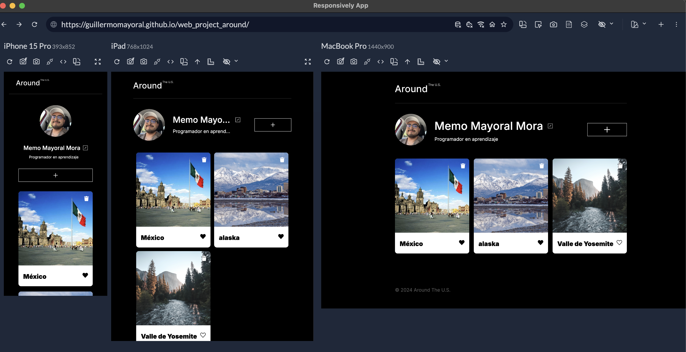
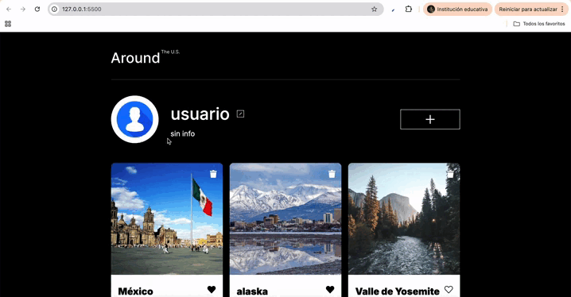

# Tripleten Web Project: Around - US

## Descripción

**Around** es una red social interactiva tipo blog diseñada para compartir imágenes de lugares impresionantes. Inicialmente un sitio estático, este proyecto ha evolucionado a una aplicación web completa que se comunica con una **API REST**.

Los usuarios pueden gestionar su perfil (nombre, descripción y avatar), ver publicaciones de otros usuarios en tiempo real, dar "me gusta" y compartir sus propias tarjetas de lugares.

El objetivo principal de esta etapa fue implementar **JavaScript Asíncrono**, comunicación con servidores mediante **Fetch API**, y una arquitectura robusta basada en **Programación Orientada a Objetos (POO)** y módulos de ES6.

---

🔗 **Ver proyecto en vivo:**  
https://guillermomayoral.github.io/web_project_around/

---

## Funcionalidades Principales

- **Conexión a API:** Todas las tarjetas y datos del usuario se cargan desde un servidor remoto.
- **Gestión de Perfil:** Editar nombre, descripción y actualizar el avatar.
- **Tarjetas Interactivas:**

  - Crear nuevas tarjetas con título y enlace de imagen.
  - **Likes:** Contador sincronizado con el servidor (persiste al recargar).
  - **Eliminación:** Icono de basura visible solo en tarjetas del propio usuario, con confirmación antes de borrar.

- **Validación de Formularios:** Validación en vivo de todos los campos con mensajes personalizados.
- **UX Mejorada:** Indicadores de carga (“Guardando…”) en los botones durante solicitudes al servidor.
- **Visualización de Imágenes:** Vista ampliada al hacer clic en la imagen de una tarjeta.

## Tecnologías y Técnicas Utilizadas

- **HTML5 & CSS3:** Estructura semántica y diseño responsive (Mobile First).
- **Metodología BEM:** Organización modular de estilos.
- **JavaScript (ES6+):**

  - **Módulos:** Import/Export para separar responsabilidades.
  - **Clases (POO):** Estructura basada en clases como `Card`, `Section`, `Popup`, etc.
  - **Asincronía:** Uso de `fetch`, `Promises`, `then/catch` para manejar la comunicación con el servidor.

## Arquitectura del Código (POO)

El proyecto sigue una estructura orientada a objetos para mantener un código limpio, escalable y con bajo acoplamiento:

- **`Api.js`**: Gestiona toda la comunicación con el servidor (GET, POST, PATCH, DELETE, PUT).
- **`Card.js`**: Crea la tarjeta, maneja sus eventos (like, delete, abrir imagen) y muestra el botón de eliminar solo cuando corresponde.
- **`Section.js`**: Renderiza elementos en el DOM.
- **`UserInfo.js`**: Controla la muestra y actualización de la información del usuario.
- **`FormValidator.js`**: Lógica general de validación para todos los formularios.
- **`Popup.js`** (clase padre):

  - `PopupWithImage`: Para ver imágenes en grande.
  - `PopupWithForm`: Para formularios.
  - `PopupWithConfirmation`: Para confirmar la eliminación de una tarjeta.

## Estructura de Archivos

.
├── blocks
│ ├── big-image.css
│ ├── content.css
│ ├── footer.css
│ ├── globals.css
│ ├── header.css
│ ├── page.css
│ ├── popup.css
│ ├── post.css
│ └── profile.css
│
├── docs
│ ├── gifs
│ │ ├── editar-perfil.gif
│ │ └── funcion-card.gif
│ └── images
│ └── views.png
│
├── fonts
│ ├── Inter-Black.woff2
│ ├── Inter-Medium.woff2
│ └── Inter-Regular.woff2
│
├── images
│ ├── Trash.svg
│ ├── button-edit.png
│ ├── card-lago-di.png
│ ├── card-lago.png
│ ├── card-latemar.png
│ ├── card-montanas.jpg
│ ├── card-valle.jpg
│ ├── card-vanois.png
│ ├── edit-icon.svg
│ ├── heart-icon-active.svg
│ ├── heart-icon.svg
│ ├── placeholder-usuario.png
│ ├── popup-close-Icon.svg
│ ├── profile-mas.svg
│ └── title.svg
│
├── node_modules
│
├── pages
│ └── index.css
│
├── scripts
│ ├── components
│ │ ├── Api.js
│ │ ├── Card.js
│ │ ├── FormValidator.js
│ │ ├── Popup.js
│ │ ├── PopupWithConfirmation.js
│ │ ├── PopupWithForm.js
│ │ ├── PopupWithImage.js
│ │ ├── Section.js
│ │ └── UserInfo.js
│ │
│ ├── utils
│ │ └── Constants.js
│ │
│ └── index.js
│
├── vendor
│ ├── fonts.css
│ └── normalize.css
│
├── .editorconfig
├── .gitignore
├── .prettierignore
├── README.md
├── favicon.ico
├── index.html
├── package-lock.json
└── package.json

## Guía de Instalación y Ejecución

1. **Clonar el repositorio:**

   git clone https://github.com/guillermomayoral/web_project_around.git

2. **Ejecutar localmente:**

   Este proyecto usa módulos ES6, así que debe correr mediante un servidor local.

   - **VS Code:** Instalar _Live Server_ y abrir `index.html` con “Go Live”.

## Galería

### 📸 Captura de vista en tres dispositivos

> 

### 📝 Gif del formulario de edición del perfil (Editar foto, nombre y descripcion)

> 

### 🖼️ Funcion de las cards (Creacion, like y borrado)

> 

© 2025 Guillermo Mayoral Mora. Proyecto realizado para el Bootcamp de Desarrollo Web de TripleTen.
